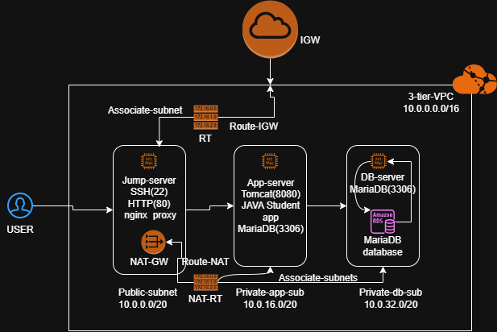

## AWS Three Tier JAVA Web Application Deployment

---

## Project Overview

This project demonstrates the deployment of a **production-ready Three Tier Java Web Application** on **Amazon Web Services (AWS)** .

The application is deployed using a custom **AWS Virtual Private Cloud (VPC)** with isolated networking . The infrastructure is divided into three independent layers :

- **Presentation Layer** – Nginx Reverse Proxy running on a Jump Server located in a Public Subnet . Handles incoming client requests and securely forwards them to the application server.
- **Application Layer** – Apache Tomcat hosting the Java Web Application on Application Server inside a Private Application Subnet . Processes business logic while remaining inaccessible from the public internet.
- **Database Layer** – Amazon RDS (MariaDB) deployed on Database Server in a Private Database Subnet . Stores application data securely with no direct public access .

---

## Project Objectives

- Design a secure AWS network using a custom VPC.
- Implement public and private subnet architecture.
- Deploy a Java web application using Apache Tomcat.
- Configure Amazon RDS (MariaDB) for persistent data storage.
- Implement Nginx as a Reverse Proxy.
- Secure SSH access through a Jump Server.
- Apply Security Groups to restrict network access.
- Demonstrate real-world cloud deployment practices.

---

## Architecture

---

## Technology

| Category | Technology |
|----------|------------|
| Cloud Provider | Amazon Web Services (AWS) |
| Compute | Amazon EC2 |
| Networking | VPC, Public & Private Subnets |
| Routing | Internet Gateway, NAT Gateway, Route Tables |
| Security | Security Groups |
| Web Server | Nginx |
| Application Server | Apache Tomcat 9 |
| Programming Language | Java |
| Database | Amazon RDS (MariaDB) |
| Operating System | Amazon Linux |
| Version Control | Git & GitHub |

---

## AWS Services Used

| AWS Service | Purpose |
|-------------|---------|
| Amazon VPC | Isolated cloud network |
| EC2 | Compute instances |
| Public Subnet | Hosts Jump Server |
| Private Application Subnet | Hosts Application Server |
| Private Database Subnet | Hosts Database server |
| Internet Gateway | Public Internet connectivity |
| NAT Gateway | Internet access for private resources |
| Elastic IP | Static IP for NAT Gateway |
| Route Tables | Network traffic routing |
| Security Groups | Instance-level firewall |
| Amazon RDS | Managed MariaDB database |

---

## Key Features

- Custom AWS VPC
- Multi-tier architecture
- Public and Private Subnets
- Jump Server for secure administration
- Reverse Proxy using Nginx
- Apache Tomcat application deployment
- Amazon RDS (MariaDB)
- Secure Security Group configuration
- Private networking
- Internet Gateway and NAT Gateway
- JDBC database connectivity
- Production-inspired infrastructure design

---

## Deployment Workflow

1. Create a Custom VPC.
2. Create Public and Private Subnets.
3. Configure Route Tables.
4. Attach the Internet Gateway.
5. Create and configure the NAT Gateway.
6. Launch the Jump Server.
7. Launch the Application Server.
8. Create the Amazon RDS instance.
9. Configure Security Groups.
10. Install Java on the Application Server.
11. Install Apache Tomcat.
12. Deploy the Student WAR application.
13. Configure JDBC connectivity with Amazon RDS.
14. Install and configure Nginx on the Jump Server.
15. Verify the application using the Jump Server's public IP.

---

## Learning Outcomes

Through this project, I gained practical experience in:

- Designing secure AWS cloud architectures
- Deploying applications using a multi-tier architecture
- Configuring public and private networking
- Managing Linux servers
- Installing and configuring Apache Tomcat
- Deploying Java web applications
- Configuring Nginx as a Reverse Proxy
- Connecting applications to Amazon RDS
- Applying AWS security best practices

---

## Future Improvements

This project can be enhanced by implementing:

- Docker containerization
- Terraform Infrastructure as Code
- Jenkins CI/CD pipeline
- HTTPS using AWS Certificate Manager
- Application Load Balancer (ALB)

